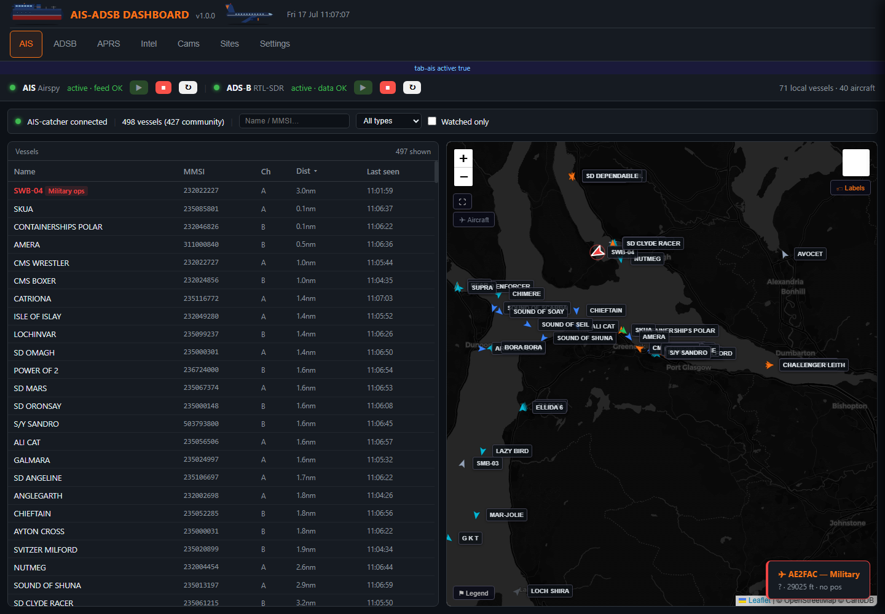
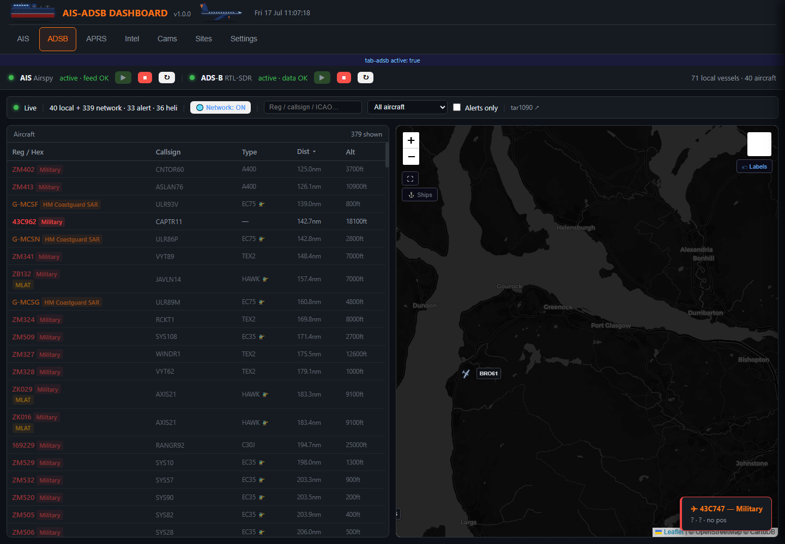
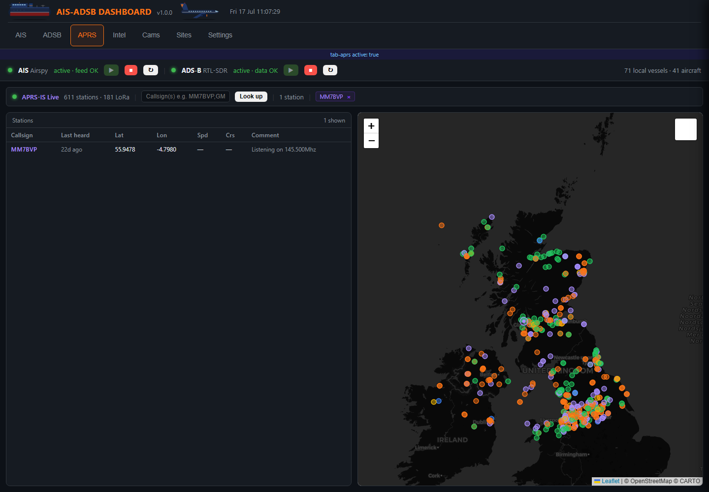
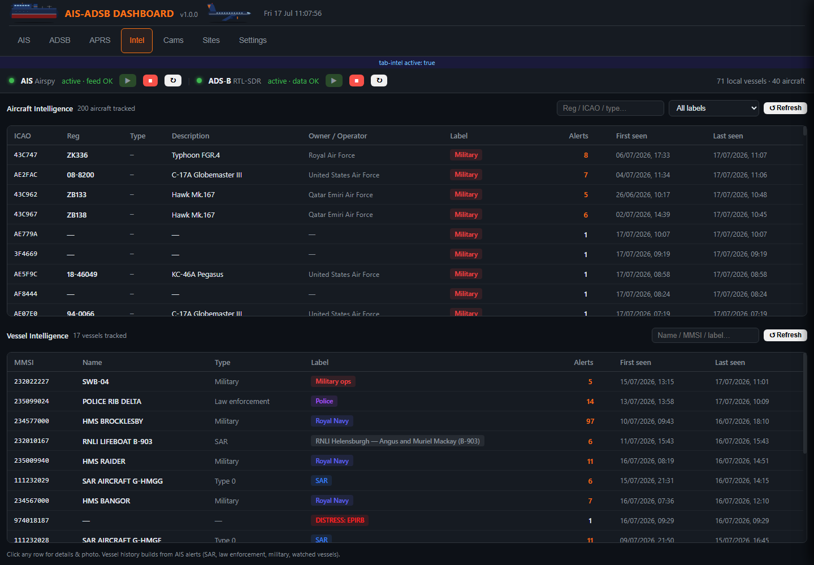

# AIS-ADSB Dashboard

A self-hosted, single-file web dashboard for a Raspberry Pi SDR monitoring station.
Live **AIS shipping**, **ADS-B aircraft**, **APRS-IS** stations, **weather / lightning**,
**tides** and an **intelligence log** — with **Telegram and Gotify push alerts** for
SAR, military, law-enforcement and watched vessels/aircraft, plus distress beacons.

Built and run on a Raspberry Pi on the Firth of Clyde, Scotland, but the watch
lists, map centre and bounding boxes are all plain Python constants you can edit
for your own area.

> **Project history:** this repository originally hosted *pager2gotify*, a small
> multimon-ng → Gotify bridge for POCSAG pager traffic. That script grew into this
> full web dashboard and the pager code has since been removed entirely. The
> original script remains available in this repo's git history.

---

## Screenshots

Live captures from the Firth of Clyde station (the running station may be a
little ahead of this repo, so tab names can differ slightly).

**AIS — live shipping on the Clyde** (498 vessels, military ops flagged):



**ADSB — local receiver + community feeds** (military/SAR highlighted, MLAT):



**APRS — APRS-IS + LoRa stations, watched-callsign lookup:**



**Intel — persistent history of every military/SAR/watched contact:**



---

## Features

| Tab | What you get |
|-----|--------------|
| **AIS** | Live ship map (Leaflet) fed by a local AIS-catcher receiver + AISstream.io community data. SVG ship icons coloured by vessel type, **rotated in real time by true heading (COG fallback)**, age-based fading, permanent name labels with a 3-state toggle (off / auto by zoom / always), fullscreen, satellite & topo layers, aircraft overlay toggle, vessel detail panel with photo + track history. |
| **ADSB** | Live aircraft from a local readsb/tar1090 receiver merged with community APIs (adsb.fi, adsb.lol, airplanes.live — rotated). tar1090 aircraft silhouettes (91 shape types), detail panel with planespotters.net photo, track history, ship overlay toggle. |
| **APRS** | Live APRS-IS feed (includes LoRa APRS) for a configurable radius, colour-coded by station type, plus aprs.fi watched-callsign lookup. |
| **Weather** | Windy embeds (radar / wind / waves / temp / clouds) and live lightning from Blitzortung. |
| **Tides** | WorldTides-powered tide graph for your configured location. |
| **Intel** | Persistent history tables of every SAR/military/watched aircraft and vessel seen, row-click opens the detail panel. |
| **Settings** | Notification toggles, station alert filters, receiver start/stop/restart controls (AIS-catcher & readsb) with feed-health indicators. |

### Alerting (Telegram + Gotify)

- Watched MMSIs / vessel-name keywords (e.g. lifeboats, coastguard, police)
- SAR / military / law-enforcement aircraft (callsign, registration, squawk,
  ICAO type and military hex-range matching against the local tar1090 DB)
- **Distress**: AIS-SART / MOB / EPIRB beacons (MMSI 970/972/974) and emergency
  squawks 7500 / 7600 / 7700 — top priority
- **SAR co-location**: an SAR vessel and SAR aircraft within 15 nm of each other
- Watchdog: alerts when the AIS feed disconnects or ADS-B data goes stale, and
  again on recovery

---

## Requirements

**Hardware / feeds** (the dashboard consumes these, it does not decode RF itself):

- An AIS receiver running [AIS-catcher](https://github.com/jvde-github/AIS-catcher)
  with its web server enabled (SSE feed on `http://localhost:8100/api/sse`)
- An ADS-B receiver running [readsb](https://github.com/wiedehopf/readsb) +
  [tar1090](https://github.com/wiedehopf/tar1090) (reads `/run/readsb/aircraft.json`
  and the tar1090 aircraft database)
- Optional: [Gotify](https://gotify.net/) server for push notifications

Either receiver is optional — tabs for missing feeds simply stay empty.
Community feeds (AISstream, adsb.fi/lol/airplanes.live) still work without any
local hardware.

**Software**: Linux, Python 3.9+, and the packages in `requirements.txt`.

---

## Installation

```bash
git clone https://github.com/bertonumber1/ais-adsb-dashboard.git
cd ais-adsb-dashboard
pip3 install -r requirements.txt        # on Debian/RPi OS add: --break-system-packages
```

### 1. Configure credentials — `secrets.json`

```bash
cp secrets.example.json secrets.json
nano secrets.json
```

| Key | What it is | Where to get it |
|-----|------------|-----------------|
| `telegram_bot_token` | Telegram bot API token | [@BotFather](https://t.me/BotFather) |
| `telegram_chat_id` | Chat ID the bot posts to | message the bot, then `https://api.telegram.org/bot<TOKEN>/getUpdates` |
| `gotify_url` / `gotify_token` | Your Gotify server + app token | Gotify web UI → Apps |
| `worldtides_key` | Tides API key (free tier is plenty) | [worldtides.info/developer](https://www.worldtides.info/developer) |
| `aisstream_key` | Community AIS WebSocket feed | [aisstream.io](https://aisstream.io/) (free) |
| `aprs_fi_key` | aprs.fi API key for watched callsigns | [aprs.fi → My account](https://aprs.fi/) |
| `aprs_callsign` | Your amateur callsign for the APRS-IS login | your licence |

Leave any key you don't use as an empty string — the related feature just stays off.
`secrets.json` is gitignored so your credentials never end up in a commit.

### 2. Localise it

All location-specific data lives in constants near the top of
`rnli_ais_adsb_dashboard.py`:

- `TIDE_LAT` / `TIDE_LON` — tide location
- `AISSTREAM_BOX` — AIS community bounding box
- `CFG mapLat/mapLon` (search `_CFG_JS`) — map centre
- `AIS_MMSI_RULES` / `AIS_NAME_RULES` — watched vessels
- `_APRS_FILTER` — APRS-IS radius filter

### 3. Run it

```bash
python3 rnli_ais_adsb_dashboard.py
```

Open `http://<pi-ip>:8083`. Settings are saved to `settings.json`, incidents and
intel to `incidents.db` (SQLite), photos are cached in `photos/`.

### 4. Run as a service

```bash
sudo cp ais-dashboard.service.example /etc/systemd/system/ais-dashboard.service
sudo nano /etc/systemd/system/ais-dashboard.service   # fix User= and the two paths
sudo systemctl daemon-reload
sudo systemctl enable --now ais-dashboard.service
journalctl -u ais-dashboard -f
```

> The receiver start/stop buttons in the Settings tab run
> `sudo -n systemctl <start|stop|restart> ais-catcher/readsb` — they need a
> passwordless sudo rule for the service user, or just ignore those buttons.

---

## API

Everything the UI uses is plain JSON + one SSE stream:

| Endpoint | Description |
|----------|-------------|
| `GET /api/events` | SSE stream — vessels, aircraft, APRS stations, alerts |
| `GET /api/ais/vessels` | All live vessels |
| `GET /api/ais/track/{mmsi}` | Vessel position history |
| `GET /api/ais/intel` | Vessel intelligence history |
| `GET /api/adsb/aircraft` | All tracked aircraft (local + community) |
| `GET /api/adsb/track/{hex}` | Aircraft position history |
| `GET /api/adsb/intel` | Aircraft intelligence history |
| `GET /api/aprs/stations` | Live APRS-IS stations |
| `GET /api/receivers` | AIS/ADS-B receiver service status + feed health |
| `GET /api/tides` | Cached tide data |

---

## Architecture notes

- **One file.** Backend (FastAPI), background reader threads and the entire
  frontend (HTML/CSS/JS served as one page) live in
  `rnli_ais_adsb_dashboard.py`. Leaflet is vendored locally so the dashboard
  works without internet for map interaction (tiles still need connectivity).
- Background threads follow a common pattern: daemon thread → parse feed →
  update in-memory dict under a lock → throttled SSE broadcast → SQLite for
  anything historical.
- SSE bursts are debounced client-side and marker icons are signature-cached,
  so ~700 live markers stay smooth on a Pi-served page.
- If you edit the embedded JS, validate it afterwards:
  extract the `<script>` blocks and run `node --check` — a Python string escape
  like `\x` inside the HTML string will silently corrupt the page.

## License

MIT — see [LICENSE](LICENSE).
